<div align="center">

# `arko@github ~ $ whoami`

### **Arko Pramanik**
**AI/ML Engineer in the making · C++ · Python · PyTorch · Systems**

Building practical AI systems, backend infrastructure, and eventually agentic AI that can survive contact with real users.

<br>



<br><br>

<table>
<tr>
<td valign="top" width="42%">

</td>
<td valign="top" width="58%">

</td>
</tr>
</table>

</div>

---

## `arko@github ~ $ cat ./stack`

```text
Languages     →  C++ · Python · SQL
AI/ML         →  PyTorch · Scikit-learn · NumPy · Pandas
Backend       →  FastAPI · REST APIs
Systems       →  Linux · Git · Docker · GitHub Actions
Cloud         →  AWS
Currently     →  DSA + ML fundamentals + AI systems
```

## `arko@github ~ $ ./focus`

- 🧠 **AI Engineering** — turning models into usable software
- ⚙️ **AI Systems** — inference, APIs, deployment, scalability
- 🤖 **Agentic AI** — tool use, orchestration, evaluation and reliability
- 📚 **Computer Science fundamentals** — DSA, OS, networking and databases

## `arko@github ~ $ ls -la ./projects`

> Replace the placeholders below with your real projects. **Do not invent projects on a public profile.**

| Project | Description | Status |
|---|---|---|
| Coming soon | Building my first serious AI/ML project | `building` |

## `arko@github ~ $ ./connect`

<p align="center">
  <a href="https://github.com/arkopramanik166">GitHub</a>
  ·
  <a href="https://www.linkedin.com/in/www.linkedin.com/in/arko-pramanik166/">LinkedIn</a>
  ·
  <a href="https://YOUR_PORTFOLIO_DOMAIN/">Portfolio</a>
</p>

---

<div align="center">

`$ echo "Build. Measure. Ship. Repeat."`

</div>
